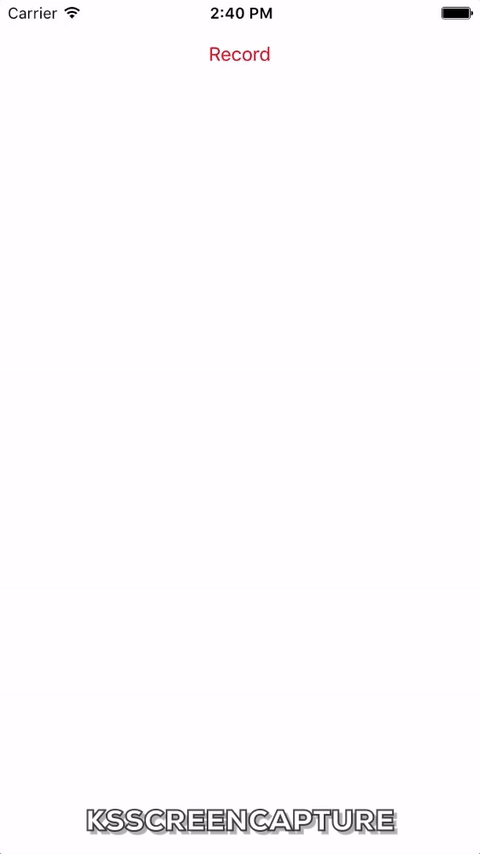

# KSScreenCapture
A tool that can capture your screen's action including audio recorder.

# Demo


1.  Clone the project in local.

2.  Access to the Demo directory and run ``` pod install ``` in terminal.

3.  Run KSScreenCaptureDemo.xcworkspace in XCode and you will see a demo application as the gif above.

# Introduce
It is used to capture your iOS application's screen including audio recording. Install the library via [cocoapod](https://cocoapods.org/) is recommended.

Besides, this library also include a audio recorder name KSAudioCapture to use the [AVAudioRecorder](https://developer.apple.com/reference/avfoundation/avaudiorecorder) functions. The benifit using KSAudioCapture is that it can help you deal with the permission problem, and you can just call it without handle the permission granting problem.

# Install

Add in your Podfile:
```
pod 'KSScreenCapture'
```

Include 'KSScreenCapture.h' wherever you want to capture your screen.

Support up to iOS 9.

# Usage
##Basic screen capture function

1.  Initialize with target and record layer:

  ``` objc
  KSScreenCapture *capture = [[KSScreenCapture alloc] initWithTarget:self CaptureLayer:recordView.layer];
  ```
  
  The recordView's width and height should be times of 32!

2.  Start record with success/failure block:
  
  ``` objc
  [capture startRecordSuccess:successCallback fail:failCallback];
  ```

3.  Declair your view controller implement the KSScreenCaptureDelegate method, and hit the delegate method when capture is done. You can handle the video source file from the videoPath in the block by youself:

  ``` objc
  - (void)KSScreenCaptureDidFinish:(KSScreenCapture *)capture path:(NSString *)videoPath {
    // Handle the video source from videoPath
    
    }
  ```
  
4.  Or you can just save the video in the photo album with one line of code which will handle the permission issue for you:

  ``` objc
  [capture saveVideoAtPathToSavedPhotosAlbum:videoPath completeSeletor:nil];
  ```

##Audio recorder function
You can also use the KSAudioCapture for audio recording only. Include the KSaudioCapture.h header file wherever you want to use it.

1.  Initialize the audio capture with file name, target and audio setting. Only target is required, other parameters can be nil by just use the default value.

  ``` objc
  audioCapture = [[KSAudioCapture alloc] initWithFileName:nil target:self setting:nil];
  ```
  
2.  Start record with success/failure block:
  
  ``` objc
  [audioCapture startRecordSuccess:successCallback fail:failCallback];
  ```
  
3.  Declair your view controller implement the KSAudioCaptureDelegate method, and hit the delegate method when capture is done. You can handle the audio source file from the url in the block by youself:

  ``` objc
  - (void)KSAudioCaptureDidFinishWithURL:(NSURL *)url successfully:(BOOL)flag {
    // Handle the audio source from file url
    
    }
  ```
  
# Acknowledgement

This tool is base on [Blazeice's work](https://github.com/Blazeice/ScreenAndAudioRecordDemoScreenAndAudioRecordDemo), thanks to Blazeice as well as wayne li.